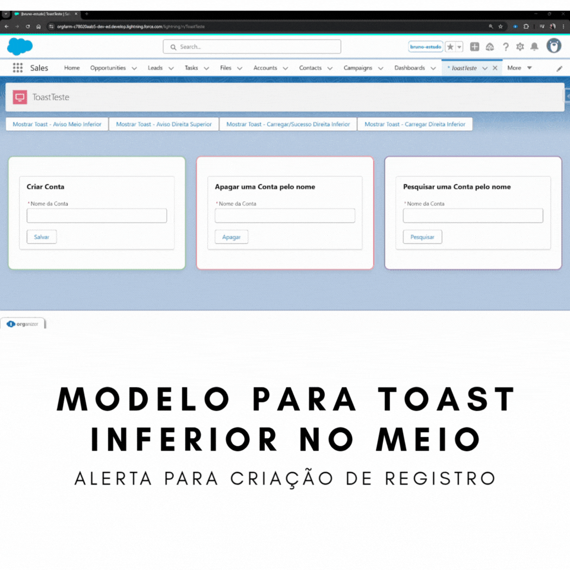
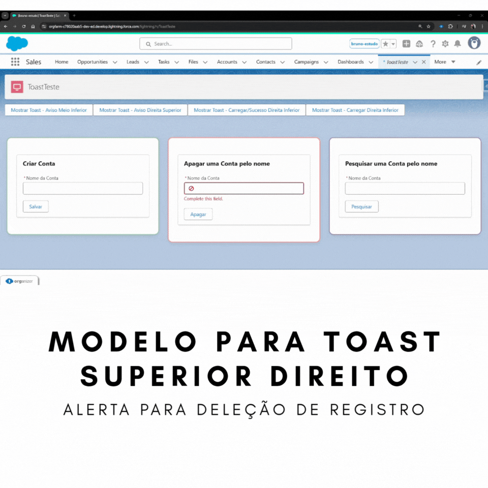
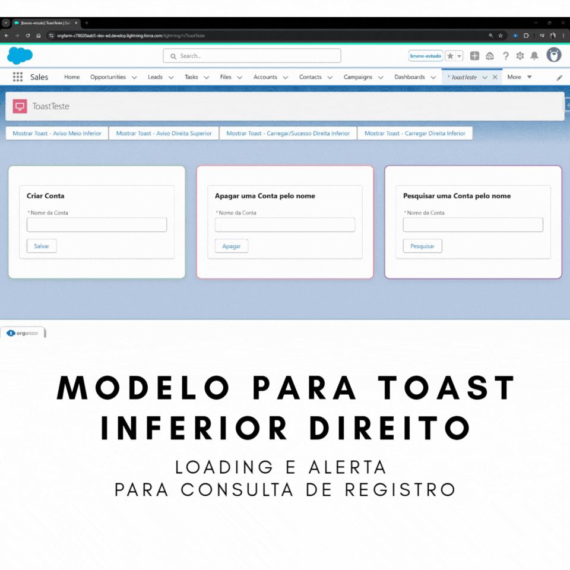

# Projeto custom-Toast

Este repositório contém diversos projetos com exemplos de **toasts personalizados** utilizados no Salesforce.

## O que é um Toast no Salesforce?

No Salesforce, um **toast** é uma notificação temporária e discreta que aparece no topo da interface, usada para informar o usuário sobre o resultado de uma ação — como a criação de um registro, erros de validação ou mensagens informativas. Os toasts ajudam a fornecer **feedback rápido e não intrusivo**, melhorando a experiência do usuário sem exigir interações adicionais.

Salesforce oferece suporte ao evento padrão [`ShowToastEvent`](https://developer.salesforce.com/docs/component-library/documentation/en/lwc/lwc.use_toast) para exibir essas notificações em componentes Lightning (LWC). Além disso, é possível criar toasts **personalizados**, com mais controle sobre estilo, comportamento, ícones e botões de ação.

🔗 Referência oficial: [Exibir notificações de toast – Salesforce Docs](https://developer.salesforce.com/docs/component-library/documentation/en/lwc/lwc.use_toast)

## Objetivo

Demonstrar diferentes formas de exibir mensagens toast no Salesforce, utilizando componentes Lightning (LWC), Apex e outras variações aplicáveis.

## Estrutura

Cada subpasta representa um exemplo ou variação diferente de toast, permitindo fácil reutilização e aprendizado.

- [Documentação CustomToast](./CustomToast/force-app/main/default/lwc/customToast/README.md)

## Exemplos incluídos (em andamento)

- Toast básico com `ShowToastEvent`
- Toast customizado com ícones personalizados
- Toast com botões de ação
- Toasts condicionais com base em regras de negócio

## Contribuições

- Convenção de branches: `YYYY-MM-DD`
- 👨🏻‍💻 [Bruno Zeulli](https://github.com/bzeulli)
- 👩🏽‍💻 [Michele Rosa](https://github.com/MimjrJ20)

## Mais

📁 Diretório: `custom-Toast`  
💡 Tema: Toasts variados utilizados no Salesforce

---

🌎

# custom-Toast Project

This repository contains various examples of **custom toast messages** used in Salesforce.

## What is a Toast in Salesforce?

In Salesforce, a **toast** is a temporary, non-blocking notification that appears at the top of the interface to inform users about the outcome of an action — such as creating a record, validation errors, or general information. Toasts help provide **quick and non-intrusive feedback**, improving the user experience without requiring further interaction.

Salesforce supports the standard [`ShowToastEvent`](https://developer.salesforce.com/docs/component-library/documentation/en/lwc/lwc.use_toast) to display toast notifications in Lightning Web Components (LWC). You can also create **custom toasts** with full control over styles, behavior, icons, and action buttons.

🔗 Official reference: [Display Toast Notifications – Salesforce Docs](https://developer.salesforce.com/docs/component-library/documentation/en/lwc/lwc.use_toast)

## Purpose

Demonstrate different ways to display toast messages in Salesforce using Lightning Web Components (LWC), Apex, and other applicable variations.

## Structure

Each subfolder represents a different toast example or variation, allowing for easy reuse and learning.

- [Documentation CustomToast](./CustomToast/force-app/main/default/lwc/customToast/README.md)

## Included Examples (in progress)

- Basic toast with `ShowToastEvent`
- Custom toast with personalized icons
- Toast with action buttons
- Conditional toasts based on business logic

<!-- Toast examples images -->
<!-- The use of 
 is allowed on GitHub, but it is not standard Markdown. 
If you want just images, you can use pure Markdown like this: -->

## Contributors

- Branch convention: `YYYY-MM-DD`
- 👨🏻‍💻 [Bruno Zeulli](https://github.com/bzeulli)
- 👩🏽‍💻 [Michele Rosa](https://github.com/MimjrJ20)

## More

📁 Directory: `custom-Toast`  
💡 Theme: Various toast implementations used in Salesforce

---